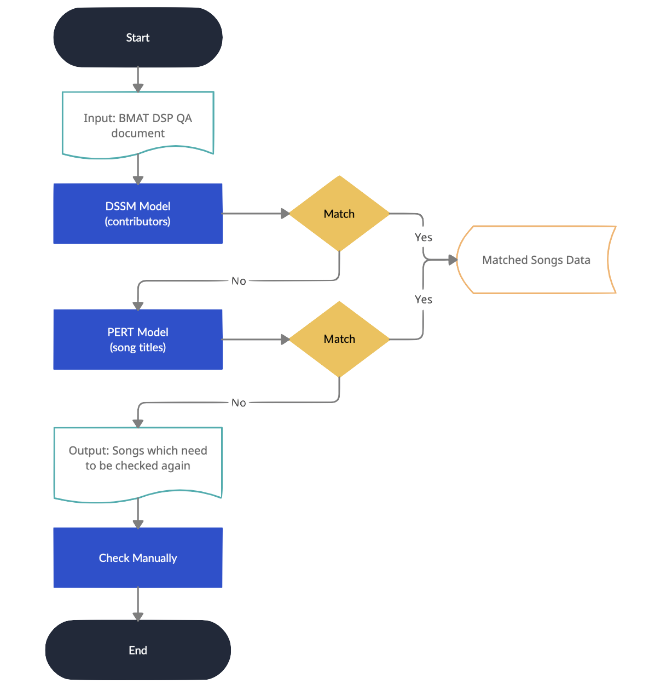

# DWave model
for comparing whether two songs are same song or not



## Setup
```bash
# Install python dependencies
pip install -r requirements.txt
```

## Prediction
```bash
python3 model_run.py
```

## Description
The model contains two parts:
1.  DSSM model: comparing contributors of songs
2.  PERT model: comparing titles of songs

```
DSSM
├── test_bmat_contributors_match.py (to train DSSM)
│
├── data (the necessary lexicon and corpus)
│   │
│   ├── contributors_dict.json (The dictionary of contributors)
│   │
│   ├── QA_DSP2_2020S2_2 (dw)_checked.xlsx (the training data)
│   │
│   └── QA_DSP1_20221h_Suspense - DW.xlsx (the testing data)
│
└── dssm-model (model path)
# All the data which is predicted False when threshold = 0.85

```
```
PERT
│── dssm_process.py (to process the output of DSSM for the input of PERT)
│── PinyinCharDataProcesser.py (to provide the dataset)
│── py2wordPert.py (to do the Pinyin-to-character conversion task by PERT)
│
├── NEZHA (the NEZHA language model)
│
├── Configs (the configurations to train PERT at various scals)
│
├── Corpus (the necessary lexicon and the example corpus)
│   ├── CharListFrmC4P.txt (the list of Chinese characters)
│   ├── pinyinList.txt (the list of pinyin tokens)
│   ├── ModernChineseLexicon4PinyinMapping.txt (the word items and the corresponding pinyin tokens in Modern Chinese Lexicon)
│   ├── PERT_title_Chinese_test.txt (the corpus of Chinese character)
│   └── PERT_title_pinyin_test.txt (the corpus of pinyin)
│
└── Models 
    ├── Bigram (The Bigram model trained on some news corpus)
    └── pert_tiny_py_lr5e4_10Bs_1e (The PERT model trained on some news corpus under the conditions of learning rate: 5e-4, batch size: 10, and epoch number: 1)
```

## Result


```
Result Folder
│
├── False_threshold_07.xlsx (false result of DSSM when threshold = 0.70)
├── False_threshold_085.xlsx (false result of DSSM when threshold = 0.85)
├── PERT_result_07.xlsx (PERT result when threshold = 0.70)
├── PERT_result_085.xlsx (PERT result when threshold = 0.85)
├── merge_result_07.xlsx (merge result of DSSM & PERT when threshold = 0.70) 
├── merge_result_085.xlsx (merge result of DSSM & PERT when threshold = 0.85) 
└── exceptionSongTitle.txt (data which cannot be predicted in PERT)
```

## Reference
```
@inproceedings{huang2013learning,
  title={Learning deep structured semantic models for web search using clickthrough data},
  author={Huang, Po-Sen and He, Xiaodong and Gao, Jianfeng and Deng, Li and Acero, Alex and Heck, Larry},
  booktitle={Proceedings of the 22nd ACM international conference on Information \& Knowledge Management},
  pages={2333--2338},
  year={2013}
}
```
```
@article{DBLP:journals/corr/abs-2205-11737,
  author    = {Jinghui Xiao and
               Qun Liu and
               Xin Jiang and
               Yuanfeng Xiong and
               Haiteng Wu and
               Zhe Zhang},
  title     = {{PERT:} {A} New Solution to Pinyin to Character Conversion Task},
  journal   = {CoRR},
  volume    = {abs/2205.11737},
  year      = {2022},
  url       = {https://doi.org/10.48550/arXiv.2205.11737},
  doi       = {10.48550/arXiv.2205.11737},
  eprinttype = {arXiv},
  eprint    = {2205.11737},
  timestamp = {Mon, 30 May 2022 15:47:29 +0200},
  biburl    = {https://dblp.org/rec/journals/corr/abs-2205-11737.bib},
  bibsource = {dblp computer science bibliography, https://dblp.org}
}
```
